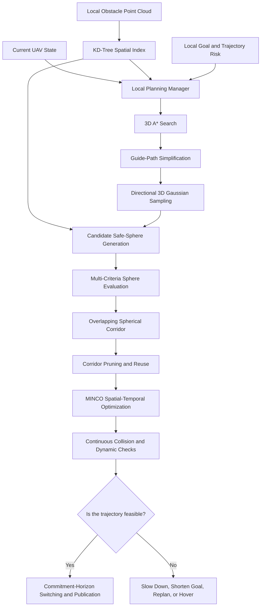

<h1 align="center">Bubble Planner Reproduction and Enhancement</h1>

<p align="center">
  <strong>A ROS1 3D Local Obstacle-Avoidance Planner for UAVs in Unknown Cluttered Environments</strong>
</p>

<p align="center">
  An unofficial reproduction and extension of Bubble Planner, featuring 3D A*, directional Gaussian sampling, overlapping spherical corridors, receding-horizon replanning, and MINCO trajectory optimization.
</p>

<p align="center">
  <a href="./README_cn.md"><strong>中文文档</strong></a>
  ·
  <a href="#citation"><strong>Citation</strong></a>
  ·
  <a href="#license"><strong>License</strong></a>
</p>

<p align="center">
  <a href="https://opensource.org/licenses/MIT"></a>
  <a href="https://www.ros.org/"></a>
  <a href="https://releases.ubuntu.com/20.04/"></a>
  <a href="https://isocpp.org/"></a>
  <a href="https://cmake.org/"></a>
  <a href="https://pointclouds.org/"></a>
  <a href="https://github.com/ZJU-FAST-Lab/GCOPTER"></a>
  
  
</p>


---

display:


---

## Overview

This repository provides a **ROS1-based 3D local obstacle-avoidance planner for quadrotor UAVs** operating in unknown and cluttered environments. It reproduces the publicly described Bubble Planner architecture and adds mechanisms for environment adaptation, trajectory-risk response, candidate-sphere evaluation, replanning continuity, and safe failure handling.

The planner takes the current UAV state, a local obstacle point cloud, a local goal, a nearest-obstacle query interface, and the risk state of the currently executed trajectory as inputs. It then:

1. Searches for a local obstacle-avoidance topology using 3D A*;
2. Performs directional 3D Gaussian sampling around guide-path points;
3. Queries free-space clearance using a KD-Tree;
4. Generates large and sufficiently overlapping safe spheres;
5. Constructs an ordered spherical flight corridor;
6. Jointly optimizes waypoints and segment durations using MINCO and L-BFGS;
7. Independently verifies collision safety and dynamic feasibility;
8. Switches references through a commitment horizon.

The output is a time-parameterized 3D trajectory that provides desired position, velocity, acceleration, and jerk. The planner does not directly output motor or attitude commands.

---

## Origin and Disclaimer

This repository is an **unofficial reproduction and extension** of:

> Yunfan Ren, Fangcheng Zhu, Wenyi Liu, Zhepei Wang, Yi Lin, Fei Gao, and Fu Zhang,  
> **“Bubble Planner: Planning High-speed Smooth Quadrotor Trajectories using Receding Corridors,”**  
> *2022 IEEE/RSJ International Conference on Intelligent Robots and Systems (IROS)*, pp. 6332–6339, 2022.  
> DOI: [10.1109/IROS47612.2022.9981518](https://doi.org/10.1109/IROS47612.2022.9981518)  
> Paper: [https://zhepeiwang.github.io/pubs/sub_2022_bubble.pdf](https://zhepeiwang.github.io/pubs/sub_2022_bubble.pdf)

This is not official source code released by the original authors, and it is not endorsed or certified by them. The original A*-guided sampling, spherical corridor, RHC, and MINCO mechanisms must not be presented as contributions of this repository.

---

## Planning Pipeline



---

## Reproduced Bubble Planner Components

### 3D A* Guide Path

The 3D A* path determines a local avoidance topology and is not executed directly. Its cost can include travel distance, obstacle proximity, heading change, body-envelope clearance, and minimum safe-sphere size. Line-of-sight simplification reduces unnecessary turns.

### Spherical Free-Space Representation

The $i$-th safe sphere is

$$
\mathcal{B}_i = \{ \mathbf{x} \in \mathbb{R}^3 \mid \Vert \mathbf{x} - \mathbf{c}_i \Vert_2 \leq r_i \}.
$$

with effective radius

$$
r_i = d_{\mathrm{obs}}(\mathbf{c}_i) - r_{\mathrm{uav}} - r_{\mathrm{safe}}.
$$

Adjacent spheres must retain sufficient overlap:

$$
\Vert \mathbf{c}_{i+1} - \mathbf{c}_i \Vert_2 \leq r_i + r_{i+1} - \delta_{\mathrm{overlap}}.
$$

### Directional 3D Gaussian Sampling

A forward guide point outside the current sphere is used as the sampling mean:

$$
\mathbf{x}_j \sim \mathcal{N}(\mu, \Sigma).
$$

The covariance is elongated along the guide direction while preserving lateral and vertical exploration.

### Receding-Horizon Corridor Reuse

During replanning, the planner removes spheres behind the UAV or invalidated by new obstacles, retains a continuous valid corridor prefix, and extends from its endpoint. Reused waypoints and segment times provide a warm start.

---

## Enhancements

### 1. Risk-State-Driven Replanning

Three trajectory-risk states are introduced:

- `SAFE`: sufficient clearance over the prediction horizon;
- `WARNING`: decreasing clearance requiring early replanning;
- `COLLISION`: predicted collision requiring immediate action.

Minimum clearance, time to collision, and remaining safe execution time determine whether the planner continues, replans, brakes, or hovers.

### 2. Environment-Adaptive Gaussian Sampling

The Gaussian covariance can be adapted using local obstacle density, sphere radius, valid-sample ratio, flight speed, path curvature, and repeated sampling failures:

$$
\Sigma_k = \mathbf{R}_k \mathrm{diag}(\sigma_{\parallel,k}^2, \sigma_{\perp,k}^2, \sigma_{z,k}^2) \mathbf{R}_k^{T}.
$$

Open regions favor forward exploration, while cluttered regions use shorter forward steps and broader lateral or vertical exploration.

### 3. Multi-Criteria Candidate-Sphere Evaluation

Candidate selection extends sphere size and overlap with forward progress, guide-path deviation, velocity alignment, centerline turning, and local risk:

$$
S_j = w_r \bar{r}_j + w_o \bar{V}_{j}^{\mathrm{overlap}} + w_p \bar{d}_{j}^{\mathrm{progress}} - w_g \bar{J}_{j}^{\mathrm{guide}} - w_\theta \bar{\theta}_j - w_\rho \bar{R}_j.
$$

### 4. Commitment-Horizon Corridor Reuse

A short portion of the currently executed trajectory is committed during replanning:

$$
\mathcal{T}_{\mathrm{commit}} = \mathbf{p}([t_{\mathrm{switch}}, t_{\mathrm{switch}} + T_{\mathrm{commit}}]).
$$

The replacement trajectory starts from the committed endpoint state, accounting for planning latency and preventing reference discontinuities.

### 5. Safe Degradation on Planning Failure

If A*, corridor generation, MINCO, or trajectory verification fails, the planner revalidates the previous trajectory, increases segment time, reduces speed, shortens the goal, adapts sampling, regenerates the corridor, generates a braking trajectory, or hovers when safe time is insufficient.

### 6. Independent Trajectory Verification

Numerical convergence is not treated as a safety guarantee. Segment duration, boundary consistency, continuity, corridor containment, obstacle clearance, and velocity, acceleration, and jerk limits are independently checked before publication.

---

## MINCO Trajectory Optimization

For a fourth-order integrator chain with snap as the equivalent control input, each segment is a seventh-order polynomial:

$$
\mathbf{p}_i(t)
= \sum_{k=0}^{7} \mathbf{c}_{i,k} t^k.
$$

The objective includes

$$
J = J_{\mathrm{snap}} + \rho_T T + J_{\mathrm{corridor}} + J_{\mathrm{velocity}} + J_{\mathrm{acceleration}} + J_{\mathrm{jerk}}.
$$

MINCO maps intermediate waypoints and segment durations to polynomial coefficients:

$$
\mathbf{C} = \mathcal{M}(\mathbf{Q}, \mathbf{T}).
$$

L-BFGS and analytic gradient propagation are used for spatial-temporal optimization.

---

## Features

- 3D grid-based A* local search;
- guide-path simplification and local-goal fallback;
- directional and adaptive 3D Gaussian sampling;
- PCL KD-Tree nearest-obstacle queries;
- 3D safe-sphere and overlap-volume computation;
- multi-criteria candidate-sphere scoring;
- continuous overlapping spherical corridors;
- receding-horizon pruning, reuse, and extension;
- waypoint and segment-time warm starts;
- seventh-order MINCO trajectory optimization;
- corridor, velocity, acceleration, and jerk constraints;
- risk-state-driven replanning;
- commitment-horizon switching;
- safe failure degradation;
- independent trajectory verification;
- ROS1 interfaces and RViz visualization;
- standalone simulation and EGO-Planner bridge.

---

## Repository Structure

```text
Bubble-Planner/
├── CMakeLists.txt
├── package.xml
├── README.md
├── README_cn.md
├── LICENSE
├── config/
│   ├── bubble_paper.yaml
│   └── bubble_enhanced.yaml
├── include/bubble_planner/
├── src/
├── launch/
├── rviz/
├── scripts/
├── tests/
└── third_party/GCOPTER/
```

---

## Planning Modes

### Paper Mode

Configuration: `config/bubble_paper.yaml`

- fixed directional Gaussian sampling;
- sphere-size and overlap scoring;
- distance and collision triggers;
- basic RHC reuse;
- MINCO trajectory optimization.

### Enhanced Mode

Configuration: `config/bubble_enhanced.yaml`

- risk-state-driven replanning;
- adaptive Gaussian covariance;
- multi-criteria sphere scoring;
- commitment-horizon management;
- jerk penalties;
- safe failure degradation;
- stricter independent verification.

---

## Requirements

| Category | Recommended Configuration |
|---|---|
| Operating system | Ubuntu 20.04 |
| Middleware | ROS Noetic |
| Language | C++14 |
| Build system | Catkin and CMake |
| Linear algebra | Eigen3 |
| Point-cloud processing | PCL |
| Nearest-neighbor search | PCL KD-Tree |
| Trajectory representation | MINCO |
| Numerical optimization | L-BFGS-Lite |
| Visualization | RViz |

---

## Build and Run

```bash
mkdir -p ~/catkin_ws/src
cd ~/catkin_ws/src
git clone https://github.com/Robot-Nav/Bubble-Planner.git
cd Bubble-Planner

./scripts/setup_dependencies.sh

cd ~/catkin_ws
rosdep install --from-paths src --ignore-src -r -y
catkin_make -DCMAKE_BUILD_TYPE=Release
source devel/setup.bash
```

Run the standalone simulation:

```bash
roslaunch bubble_planner demo_sim.launch
```

Connect to an EGO-Planner simulation environment:

```bash
roslaunch bubble_planner ego_sim_bridge.launch \
  cloud_topic:=/map_generator/global_cloud \
  odom_topic:=/odom_world \
  frame_id:=world
```

---

## Safety Notice

> [!WARNING]
> This repository is a research and simulation prototype. Before deployment on a real UAV, validate sensor calibration, time synchronization, coordinate frames, dynamics, braking distance, planning latency, failure protection, and emergency behavior in a controlled environment.

Missing obstacle points do not imply known free space. Previous trajectories must be revalidated against the latest point cloud. Numerical convergence does not replace independent collision checking. A real system must include controller-level emergency hovering or braking.

---

## Citation

### Original Bubble Planner

```bibtex
@inproceedings{ren2022bubble,
  title     = {Bubble Planner: Planning High-speed Smooth Quadrotor Trajectories using Receding Corridors},
  author    = {Ren, Yunfan and Zhu, Fangcheng and Liu, Wenyi and Wang, Zhepei and Lin, Yi and Gao, Fei and Zhang, Fu},
  booktitle = {2022 IEEE/RSJ International Conference on Intelligent Robots and Systems (IROS)},
  pages     = {6332--6339},
  year      = {2022},
  doi       = {10.1109/IROS47612.2022.9981518}
}
```

### GCOPTER / MINCO

```bibtex
@article{wang2022gcopter,
  title   = {Geometrically Constrained Trajectory Optimization for Multicopters},
  author  = {Wang, Zhepei and Zhou, Xin and Xu, Chao and Gao, Fei},
  journal = {IEEE Transactions on Robotics},
  volume  = {38},
  number  = {5},
  pages   = {3259--3278},
  year    = {2022},
  doi     = {10.1109/TRO.2022.3160022}
}
```

### This Repository

```bibtex
@software{bubble_planner_reproduction_enhancement_2026,
  author  = {Robot-Nav},
  title   = {Bubble Planner Reproduction and Enhancement: A ROS1 3D Local Planner for UAVs},
  year    = {2026},
  url     = {https://github.com/Robot-Nav/Bubble-Planner},
  version = {v1.0.0},
  note    = {Unofficial research reproduction and enhancement of Bubble Planner}
}
```

### Related Resources

- Bubble Planner PDF: <https://zhepeiwang.github.io/pubs/sub_2022_bubble.pdf>
- Bubble Planner DOI: <https://doi.org/10.1109/IROS47612.2022.9981518>
- GCOPTER: <https://github.com/ZJU-FAST-Lab/GCOPTER>
- EGO-Planner: <https://github.com/ZJU-FAST-Lab/ego-planner>
- LBFGS-Lite: <https://github.com/ZJU-FAST-Lab/LBFGS-Lite>

---

## License

 [MIT License](https://opensource.org/licenses/MIT).
