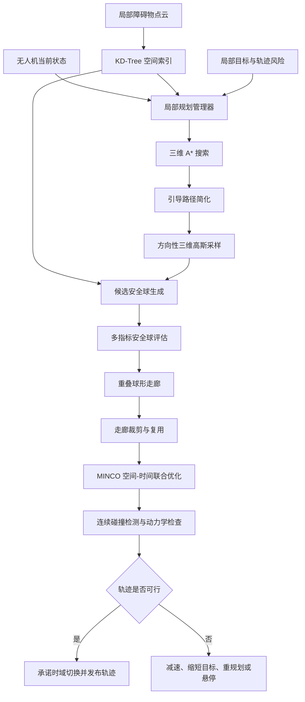

<h1 align="center">Bubble Planner 复现与增强</h1>

<p align="center">
  <strong>面向未知复杂环境的 ROS1 三维无人机局部避障规划器</strong>
</p>

<p align="center">
  本项目对 Bubble Planner 进行非官方工程复现与扩展，包含三维 A*、方向性高斯采样、重叠球形走廊、滚动时域重规划以及 MINCO 轨迹优化。
</p>

<p align="center">
  <a href="./README.md"><strong>English</strong></a>
  ·
  <a href="#引用"><strong>引用</strong></a>
  ·
  <a href="#许可证"><strong>许可证</strong></a>
</p>

<p align="center">
  <a href="https://opensource.org/licenses/MIT"></a>
  <a href="https://www.ros.org/"></a>
  <a href="https://releases.ubuntu.com/20.04/"></a>
  <a href="https://isocpp.org/"></a>
  <a href="https://cmake.org/"></a>
  <a href="https://pointclouds.org/"></a>
  <a href="https://github.com/ZJU-FAST-Lab/GCOPTER"></a>
  
  
</p>

---

## 项目概述

本仓库提供一个面向未知复杂环境的、**基于 ROS1 的四旋翼无人机三维局部避障规划器**。项目依据公开论文中描述的 Bubble Planner 架构进行复现，并进一步加入环境自适应、轨迹风险响应、候选安全球评估、重规划连续性以及规划失败安全降级等机制。

规划器以无人机当前状态、局部障碍物点云、局部目标、最近障碍物查询接口以及当前执行轨迹的风险状态作为输入，主要执行以下步骤：

1. 使用三维 A* 搜索局部绕障拓扑路径；
2. 在引导路径点附近执行方向性三维高斯采样；
3. 通过 KD-Tree 查询候选位置的自由空间净空距离；
4. 生成半径较大且具有充分重叠的安全球；
5. 构建有序连续的球形飞行走廊；
6. 使用 MINCO 和 L-BFGS 联合优化中间航点与轨迹分段时间；
7. 独立验证轨迹的碰撞安全性和动力学可行性；
8. 通过承诺时域完成新旧参考轨迹的连续切换。

规划器最终输出一条带时间参数的三维轨迹，可提供期望位置、速度、加速度和加加速度（jerk）。本规划器不直接输出电机指令或姿态控制指令。

---

## 项目来源与免责声明

本仓库是对以下工作的**非官方复现与扩展**：

> Yunfan Ren, Fangcheng Zhu, Wenyi Liu, Zhepei Wang, Yi Lin, Fei Gao, and Fu Zhang,  
> **“Bubble Planner: Planning High-speed Smooth Quadrotor Trajectories using Receding Corridors,”**  
> *2022 IEEE/RSJ International Conference on Intelligent Robots and Systems (IROS)*, pp. 6332–6339, 2022.  
> DOI：[10.1109/IROS47612.2022.9981518](https://doi.org/10.1109/IROS47612.2022.9981518)  
> 论文：[https://zhepeiwang.github.io/pubs/sub_2022_bubble.pdf](https://zhepeiwang.github.io/pubs/sub_2022_bubble.pdf)

本仓库不是原作者发布的官方源码，也未获得原作者的背书或认证。论文中已有的 A* 引导采样、球形走廊、滚动时域走廊复用以及 MINCO 等机制，不应被表述为本仓库的原创贡献。

---

## 规划流程



---

## Bubble Planner 复现部分

### 三维 A* 引导路径

三维 A* 路径用于确定局部绕障的拓扑结构，并不会被无人机直接执行。其代价函数可以综合考虑路径长度、障碍物接近程度、航向变化、机体包络净空以及最小安全球半径等因素。随后通过视线可达性简化，去除不必要的转折点。

### 球形自由空间表示

第 $i$ 个安全球定义为：

$$
\mathcal{B}_i = \{ \mathbf{x} \in \mathbb{R}^3 \mid \Vert \mathbf{x} - \mathbf{c}_i \Vert_2 \leq r_i \}.
$$

其中，有效安全半径为：

$$
r_i = d_{\mathrm{obs}}(\mathbf{c}_i) - r_{\mathrm{uav}} - r_{\mathrm{safe}}.
$$

式中，$d_{\mathrm{obs}}(\mathbf{c}_i)$ 表示球心到最近障碍物的距离，$r_{\mathrm{uav}}$ 表示无人机机体包络半径，$r_{\mathrm{safe}}$ 表示附加安全裕量。

相邻安全球之间必须保留足够的重叠区域：

$$
\Vert \mathbf{c}_{i+1} - \mathbf{c}_i \Vert_2 \leq r_i + r_{i+1} - \delta_{\mathrm{overlap}}.
$$

其中，$\delta_{\mathrm{overlap}}$ 用于约束相邻安全球之间的最小重叠程度。

### 方向性三维高斯采样

选择位于当前安全球外部、沿引导路径前进方向的点作为高斯分布均值，候选点按照下式采样：

$$
\mathbf{x}_j \sim \mathcal{N}(\mu, \Sigma).
$$

协方差矩阵沿引导方向适当拉长，同时保留横向和竖直方向的探索能力，从而兼顾前向推进效率与复杂环境中的绕障能力。

### 滚动时域走廊复用

重规划时，规划器删除已经位于无人机后方的安全球，以及被新障碍物侵入后失效的安全球；保留仍连续有效的走廊前缀，并从其末端继续扩展。复用的航点和轨迹分段时间可作为下一次优化的热启动初值。

---

## 增强部分

### 1. 基于风险状态的重规划

系统引入三种轨迹风险状态：

- `SAFE`：预测时域内具有足够的障碍物净空；
- `WARNING`：净空持续下降，需要提前触发重规划；
- `COLLISION`：预测轨迹将发生碰撞，需要立即采取措施。

系统根据最小净空距离、预计碰撞时间以及剩余安全执行时间，决定继续执行当前轨迹、触发重规划、生成制动轨迹或进入悬停状态。

### 2. 环境自适应高斯采样

高斯采样协方差可以根据局部障碍物密度、安全球半径、有效采样比例、飞行速度、路径曲率以及连续采样失败次数进行动态调整：

$$
\Sigma_k = \mathbf{R}_k \mathrm{diag}(\sigma_{\parallel,k}^2, \sigma_{\perp,k}^2, \sigma_{z,k}^2) \mathbf{R}_k^{T}.
$$

其中，$\mathbf{R}_k$ 用于将局部采样坐标系旋转到当前引导方向。开阔区域优先扩大前向探索范围；障碍物密集区域则缩短前向步长，并增强横向或竖直方向的搜索能力。

### 3. 多指标候选安全球评估

候选安全球不仅根据球半径和重叠程度进行评价，还综合考虑前向推进量、偏离引导路径的程度、速度方向一致性、走廊中心线转角以及局部风险：

$$
S_j = w_r \bar{r}_j + w_o \bar{V}_{j}^{\mathrm{overlap}} + w_p \bar{d}_{j}^{\mathrm{progress}} - w_g \bar{J}_{j}^{\mathrm{guide}} - w_\theta \bar{\theta}_j - w_\rho \bar{R}_j.
$$

其中，$S_j$ 为第 $j$ 个候选安全球的综合得分，各权重参数用于平衡空间尺度、走廊连续性、前向推进效率、路径偏差、转向平滑性与局部碰撞风险。

### 4. 承诺时域走廊复用

在重规划期间，系统保留当前正在执行轨迹中的一小段作为承诺轨迹：

$$
\mathcal{T}_{\mathrm{commit}} = \mathbf{p}([t_{\mathrm{switch}}, t_{\mathrm{switch}} + T_{\mathrm{commit}}]).
$$

新轨迹从承诺轨迹末端对应的位置、速度、加速度等状态开始生成。该机制能够显式考虑规划计算延迟，并减少新旧参考轨迹切换时的位置或高阶状态突变。

### 5. 规划失败时的安全降级

当 A* 搜索、球形走廊生成、MINCO 优化或轨迹验证失败时，规划器可依次尝试重新验证上一条轨迹、增加轨迹分段时间、降低速度、缩短局部目标、自适应调整采样范围、重新生成走廊、生成制动轨迹，或者在剩余安全时间不足时进入悬停状态。

### 6. 独立轨迹验证

优化器数值收敛并不等价于轨迹安全。轨迹发布前，系统会独立检查分段时间、边界状态一致性、轨迹连续性、走廊包含关系、障碍物净空，以及速度、加速度和加加速度约束。

---

## MINCO 轨迹优化

对于以 snap 作为等效控制输入的四阶积分器链，每一段轨迹可表示为七阶多项式：

$$
\mathbf{p}_i(t)
= \sum_{k=0}^{7} \mathbf{c}_{i,k} t^k.
$$

优化目标可以写为：

$$
J = J_{\mathrm{snap}} + \rho_T T + J_{\mathrm{corridor}} + J_{\mathrm{velocity}} + J_{\mathrm{acceleration}} + J_{\mathrm{jerk}}.
$$

其中，目标函数综合考虑轨迹 snap、总时间、走廊约束、速度约束、加速度约束和 jerk 约束。

MINCO 将中间航点和各轨迹分段时间映射为多项式系数：

$$
\mathbf{C} = \mathcal{M}(\mathbf{Q}, \mathbf{T}).
$$

随后使用 L-BFGS 和解析梯度传播完成空间与时间的联合优化。

---

## 功能特性

- 基于三维栅格的 A* 局部搜索；
- 引导路径简化与局部目标回退；
- 方向性和环境自适应三维高斯采样；
- 基于 PCL KD-Tree 的最近障碍物查询；
- 三维安全球生成与球体重叠体积计算；
- 多指标候选安全球评分；
- 连续重叠球形走廊构建；
- 滚动时域走廊裁剪、复用与扩展；
- 航点和轨迹分段时间热启动；
- 七阶 MINCO 轨迹优化；
- 走廊、速度、加速度和 jerk 约束；
- 基于轨迹风险状态的重规划；
- 承诺时域轨迹切换；
- 规划失败安全降级；
- 独立轨迹安全验证；
- ROS1 接口与 RViz 可视化；
- 独立仿真环境与 EGO-Planner 仿真桥接。

---

## 仓库结构

```text
bubble_planner_reproduction/
├── CMakeLists.txt
├── package.xml
├── README.md
├── README_zh-CN.md
├── LICENSE
├── config/
│   ├── bubble_paper.yaml
│   └── bubble_enhanced.yaml
├── launch/
│   ├── demo_sim.launch
│   └── ego_sim_bridge.launch
├── include/
├── src/
├── scripts/
└── docs/
```

---

## 规划模式

### 论文复现模式

配置文件：`config/bubble_paper.yaml`

- 固定方向性高斯采样；
- 基于安全球半径和重叠程度的评分；
- 基于距离和碰撞状态的触发机制；
- 基础滚动时域走廊复用；
- MINCO 轨迹优化。

### 增强模式

配置文件：`config/bubble_enhanced.yaml`

- 基于轨迹风险状态的重规划；
- 自适应高斯协方差；
- 多指标安全球评分；
- 承诺时域管理；
- jerk 惩罚项；
- 规划失败安全降级；
- 更严格的独立轨迹验证。

---

## 运行环境

| 类别 | 推荐配置 |
|---|---|
| 操作系统 | Ubuntu 20.04 |
| 中间件 | ROS Noetic |
| 编程语言 | C++14 |
| 构建系统 | Catkin 和 CMake |
| 线性代数库 | Eigen3 |
| 点云处理 | PCL |
| 最近邻搜索 | PCL KD-Tree |
| 轨迹表示 | MINCO |
| 数值优化 | L-BFGS-Lite |
| 可视化 | RViz |

---

## 编译与运行

```bash
mkdir -p ~/catkin_ws/src
cd ~/catkin_ws/src
git clone https://github.com/<YOUR_GITHUB_USERNAME>/<REPOSITORY_NAME>.git
cd <REPOSITORY_NAME>

./scripts/setup_dependencies.sh

cd ~/catkin_ws
rosdep install --from-paths src --ignore-src -r -y
catkin_make -DCMAKE_BUILD_TYPE=Release
source devel/setup.bash
```

运行独立仿真：

```bash
roslaunch bubble_planner_reproduction demo_sim.launch
```

连接到 EGO-Planner 仿真环境：

```bash
roslaunch bubble_planner_reproduction ego_sim_bridge.launch \
  cloud_topic:=/map_generator/global_cloud \
  odom_topic:=/odom_world \
  frame_id:=world
```

发布仓库前，请将命令中的占位符替换为真实的 GitHub 用户名和仓库名称。

---

## 安全说明

> [!WARNING]
> 本仓库属于科研与仿真原型。在部署到真实无人机之前，必须在受控环境中充分验证传感器标定、时间同步、坐标系关系、飞行动力学、制动距离、规划延迟、故障保护以及紧急行为。

点云中缺少障碍物点并不代表该区域已经被确认为空闲空间。上一条轨迹必须根据最新点云重新进行安全验证。优化器数值收敛不能替代独立碰撞检测。真实系统还必须在控制器层实现紧急悬停或制动保护。

---

## 引用

### 原始 Bubble Planner 论文

```bibtex
@inproceedings{ren2022bubble,
  title     = {Bubble Planner: Planning High-speed Smooth Quadrotor Trajectories using Receding Corridors},
  author    = {Ren, Yunfan and Zhu, Fangcheng and Liu, Wenyi and Wang, Zhepei and Lin, Yi and Gao, Fei and Zhang, Fu},
  booktitle = {2022 IEEE/RSJ International Conference on Intelligent Robots and Systems (IROS)},
  pages     = {6332--6339},
  year      = {2022},
  doi       = {10.1109/IROS47612.2022.9981518}
}
```

### GCOPTER / MINCO

```bibtex
@article{wang2022gcopter,
  title   = {Geometrically Constrained Trajectory Optimization for Multicopters},
  author  = {Wang, Zhepei and Zhou, Xin and Xu, Chao and Gao, Fei},
  journal = {IEEE Transactions on Robotics},
  volume  = {38},
  number  = {5},
  pages   = {3259--3278},
  year    = {2022},
  doi     = {10.1109/TRO.2022.3160022}
}
```

### 本仓库

仓库正式发布后，请根据实际信息修改作者、URL 和版本号：

```bibtex
@software{bubble_planner_reproduction_enhancement_2026,
  author  = {Robot-Nav},
  title   = {Bubble Planner Reproduction and Enhancement: A ROS1 3D Local Planner for UAVs},
  year    = {2026},
  url     = {https://github.com/Robot-Nav/Bubble-Planner},
  version = {v1.0.0},
  note    = {Unofficial research reproduction and enhancement of Bubble Planner}
}
```

### 相关资源

- Bubble Planner 论文 PDF：<https://zhepeiwang.github.io/pubs/sub_2022_bubble.pdf>
- Bubble Planner DOI：<https://doi.org/10.1109/IROS47612.2022.9981518>
- GCOPTER：<https://github.com/ZJU-FAST-Lab/GCOPTER>
- EGO-Planner：<https://github.com/ZJU-FAST-Lab/ego-planner>
- LBFGS-Lite：<https://github.com/ZJU-FAST-Lab/LBFGS-Lite>

---

## 许可证

[MIT License](https://opensource.org/licenses/MIT) 

